# 🦾🤖Term.ooo Bot

Oi pessoal, esse repo conta com dois projetos:

## Achar Palavra Ideal

Este projeto tem um código que tenta encontrar a palavra ideal para começar, por força bruta. Não existe nenhuma ordenação especifica das palavras (por exemplo por frequencia de uso ou algo do tipo)
* Linguagem: C#
* Framework: dotnet core
* Execução: `cd palavra-ideal && dotnet run`

## Bot do Term.ooo

Este projeto foi feito como um bot que acessa o site term.ooo, utilizando [puppeteer](https://github.com/puppeteer/puppeteer), resolve o desafio e compartilha o resultado no [twitter](https://twitter.com/TermoooB)
* Linguagem: javascript
* Framework: Node.js
* Execução: `cd bot && npm install && node termoo-puppeteer.js`

Para a execução correta dele é necessário configurar corretamente as chaves do twitter no arquivo `tweet.js`

## 06/02/2022

## 07/02/2022

## 08/02/2022
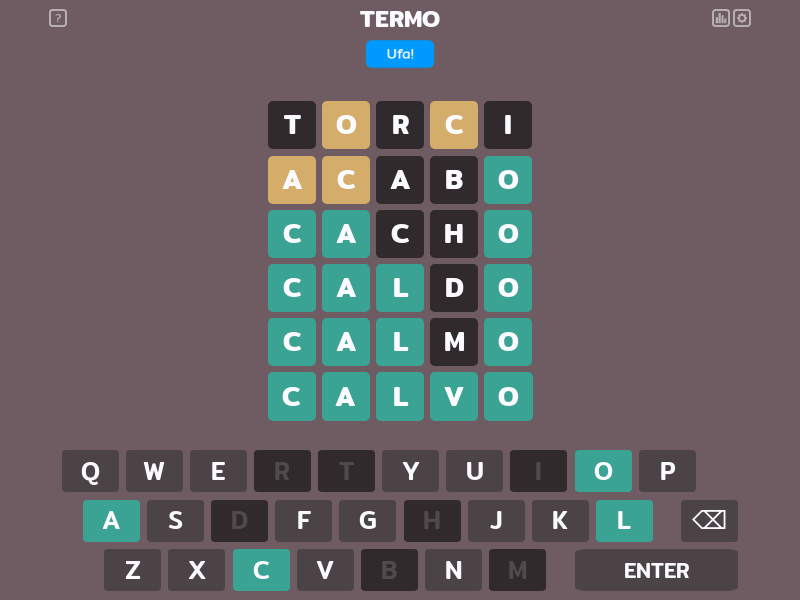
## 09/02/2022
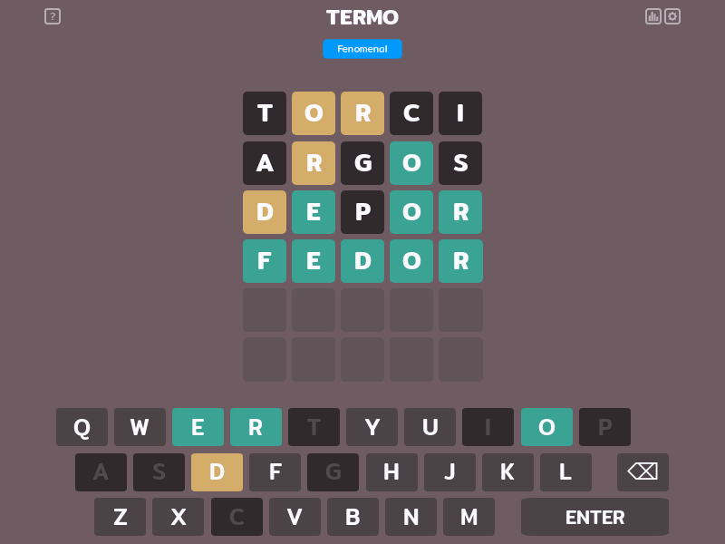
## 10/02/2022
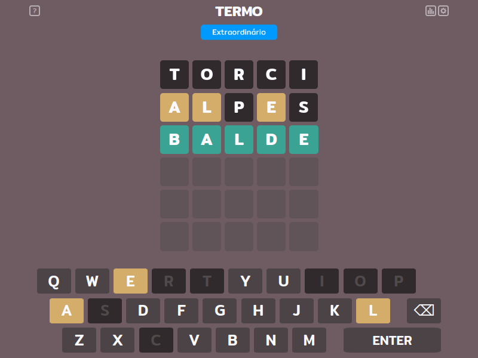
## 11/02/2022
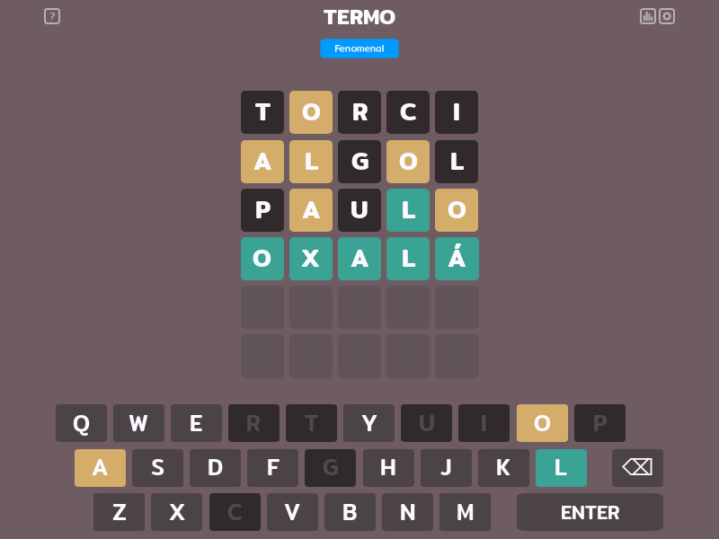
## 12/02/2022

## 13/02/2022
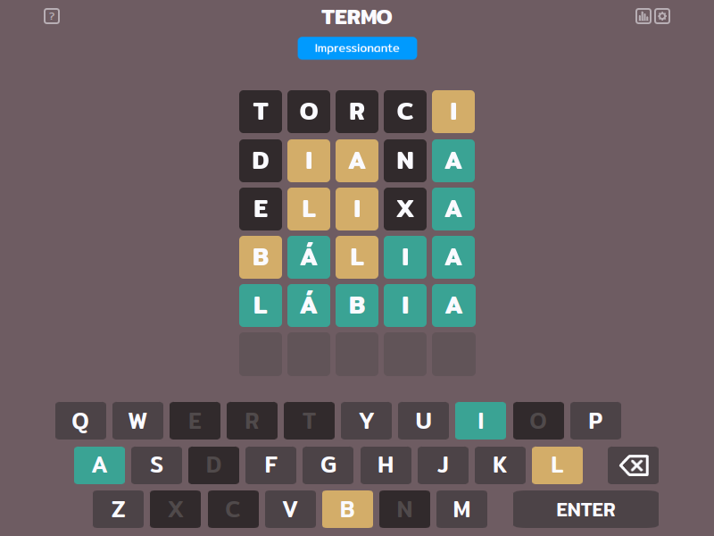
## 14/02/2022
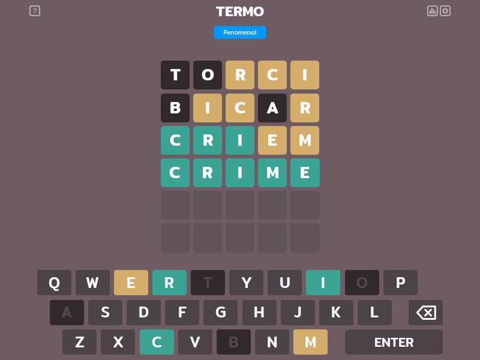
## 15/02/2022
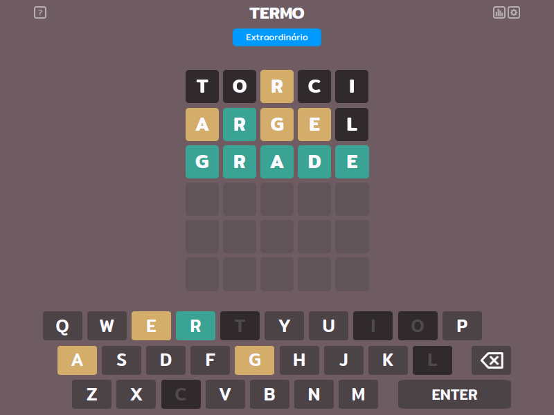
## 16/02/2022
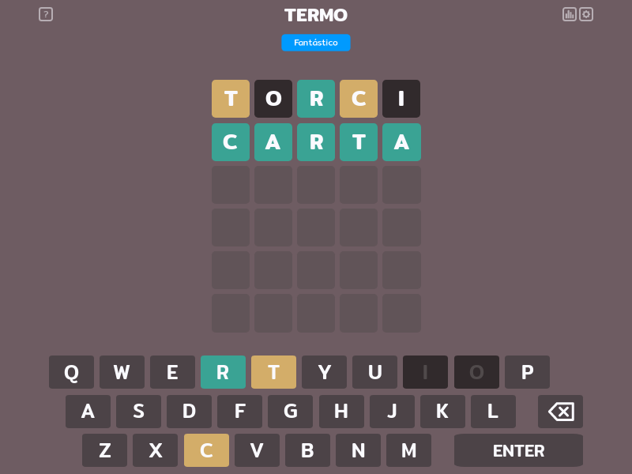
## 17/02/2022
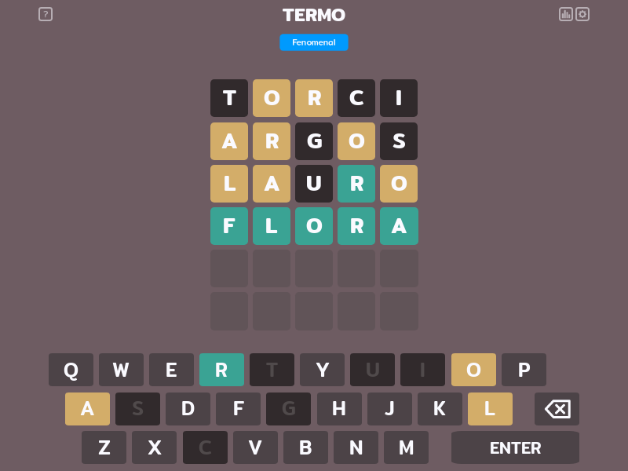
## 18/02/2022
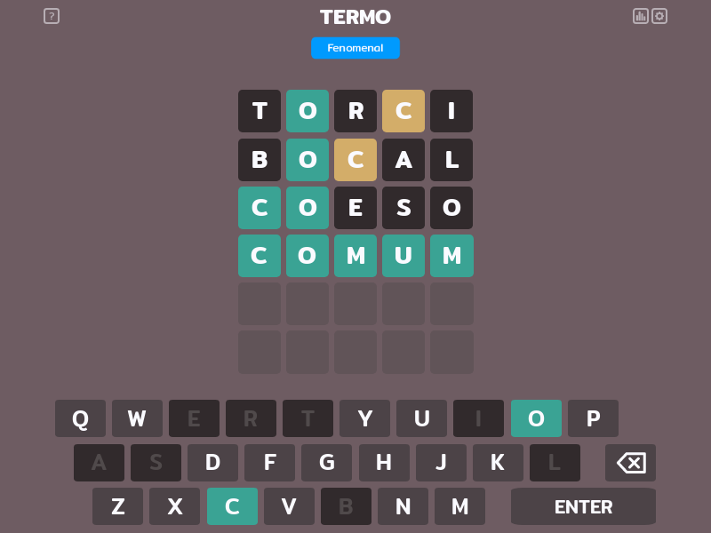
## 19/02/2022

## 20/02/2022

## 22/02/2022
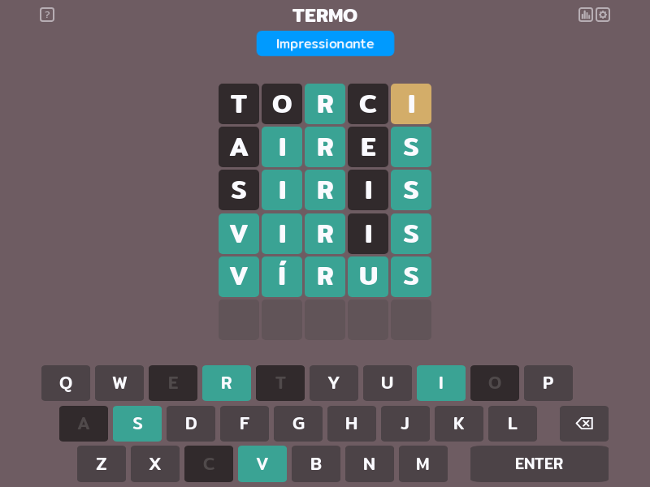
## 23/02/2022
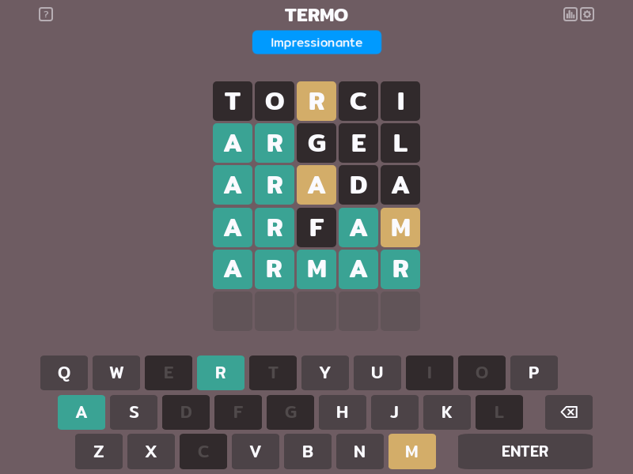
## 24/02/2022
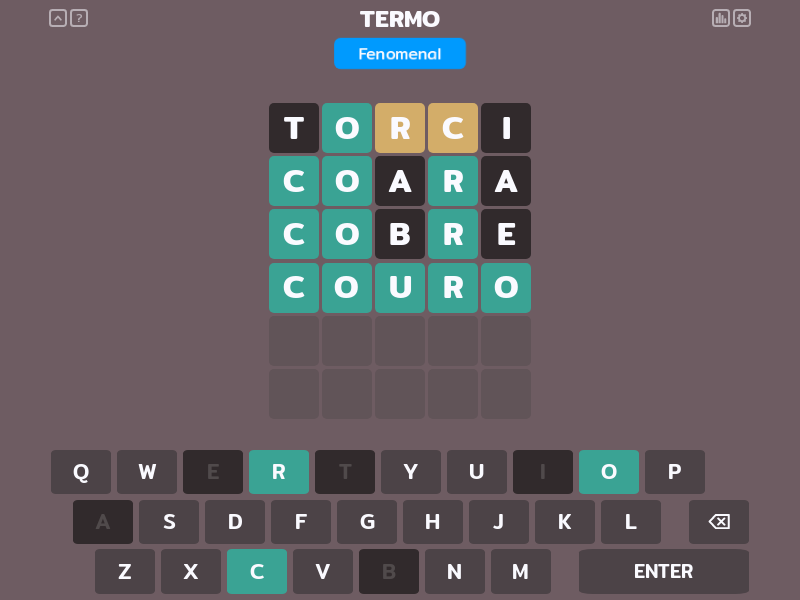
## 25/02/2022

## 26/02/2022

## 27/02/2022

## 28/02/2022

## 01/03/2022

## 02/03/2022
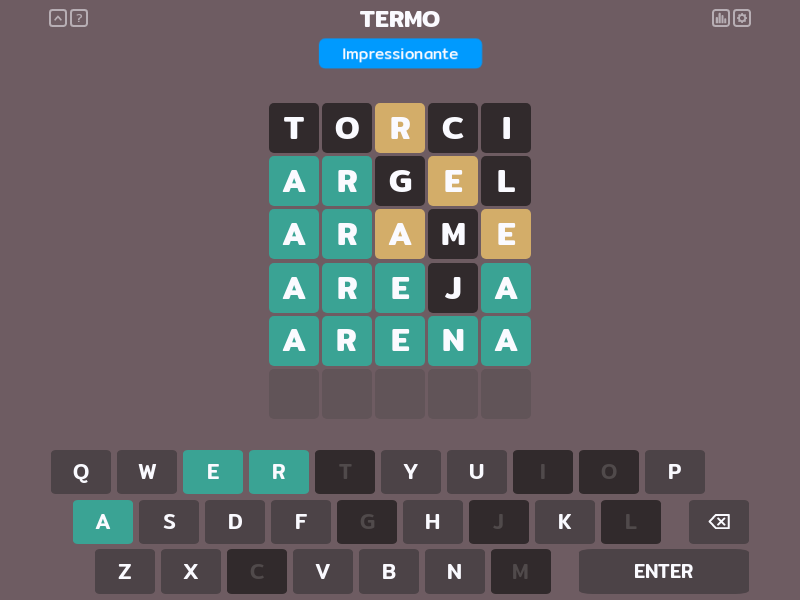
## 03/03/2022

## 04/03/2022

## 05/03/2022
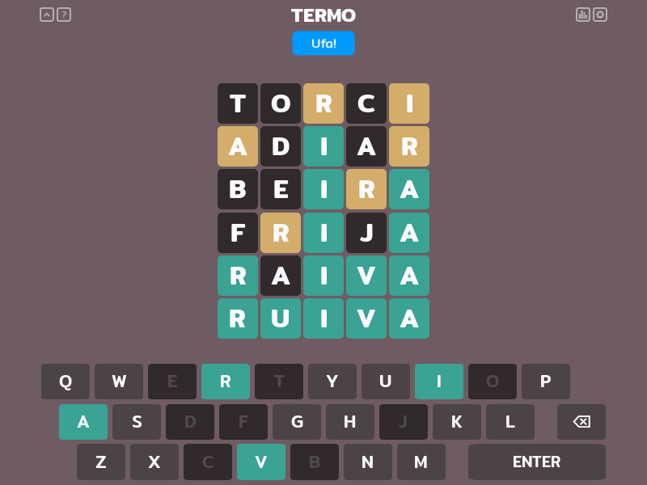
## 06/03/2022
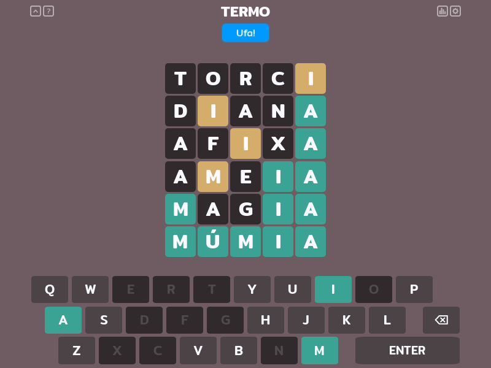
## 07/03/2022

## 08/03/2022

## 09/03/2022

## 10/03/2022
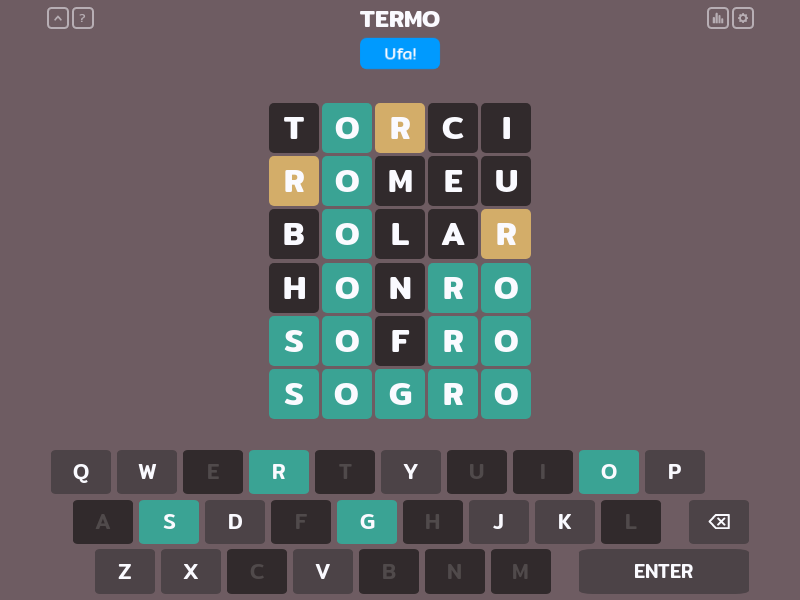
## 11/03/2022
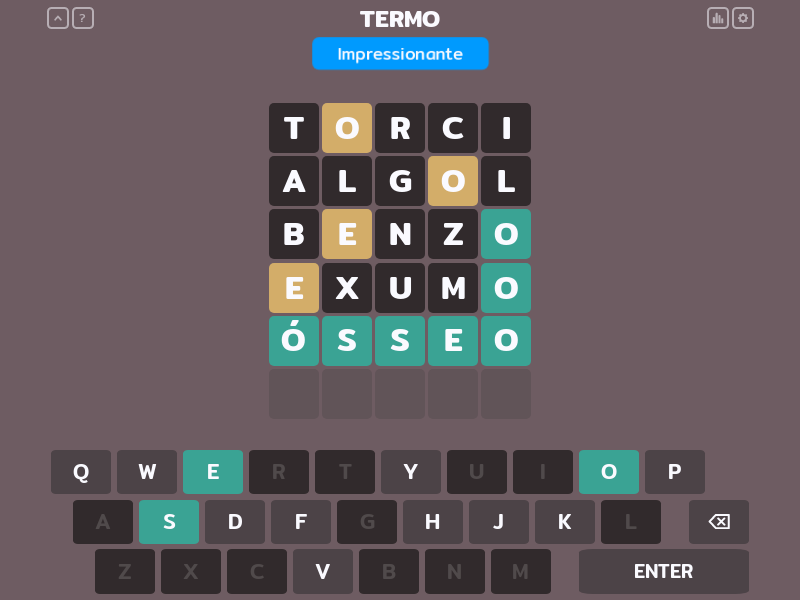
## 12/03/2022
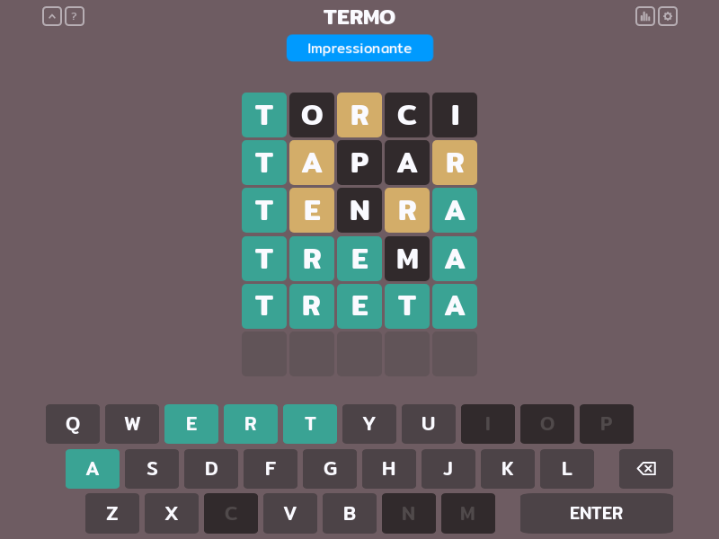
## 13/03/2022

## 14/03/2022

## 15/03/2022

## 16/03/2022
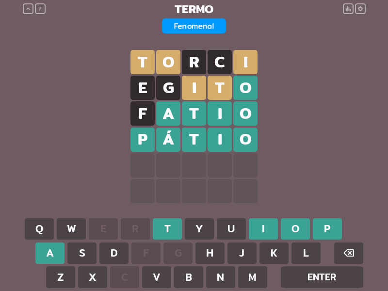